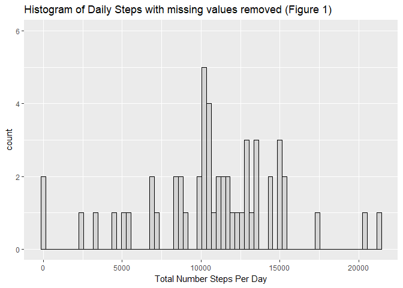
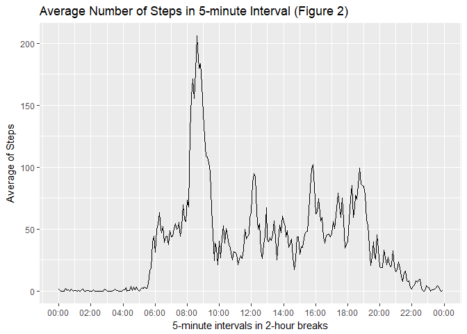
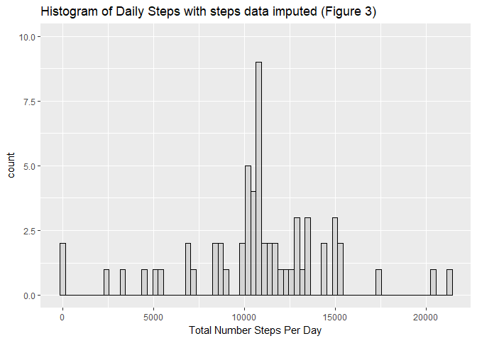
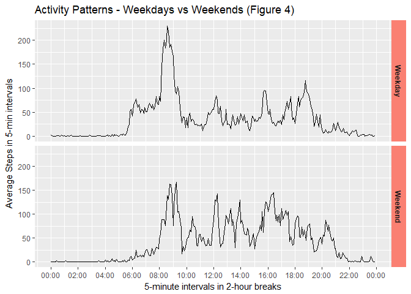

# Reproducible Research - Course Project 1

####This report is written to analyze the data of daily steps collected from an anonymous subject during October and November 2012.  The # of steps were recorded every 5 minutes.    


  
  
## Dataset Loading and Processing
***  

####The dataset (activity.csv) supplies 3 variables -- steps, date and interval.


```r
dt = as.data.table(read.csv("activity.csv"))
str(dt)
```

```
## Classes 'data.table' and 'data.frame':	17568 obs. of  3 variables:
##  $ steps   : int  NA NA NA NA NA NA NA NA NA NA ...
##  $ date    : Factor w/ 61 levels "2012-10-01","2012-10-02",..: 1 1 1 1 1 1 1 1 1 1 ...
##  $ interval: int  0 5 10 15 20 25 30 35 40 45 ...
##  - attr(*, ".internal.selfref")=<externalptr>
```

## Total Steps Histogram  
***  

####Let's draw the histogram for the total number of daily steps. The missing values in the steps column are  removed for this graph.  


```r
dtDaySteps = dt %>% filter(!is.na(steps)) %>% group_by (date) %>% summarize(sum(steps))
names(dtDaySteps)= c("date","totSteps")

p1 = qplot(dtDaySteps$totSteps,
      geom="histogram",
      binwidth = 300,  
      main = "Histogram of Daily Steps with missing values removed (Figure 1)", 
      xlab = "Total Number Steps Per Day",  
      fill=I("grey"), 
      col=I("black"), 
      alpha=I(.5),
      ylim=c(0,6))
print(p1)
```

<!-- -->


####The mean and median of the daily total steps: 


```r
mean(dtDaySteps$totSteps)
```

```
## [1] 10766.19
```

```r
median(dtDaySteps$totSteps)
```

```
## [1] 10765
```

## Daily Activity Patterns  
***  

####In order to ascertain the patterns of the anonymous subject, let's compute the steps average of each interval grouping. The missing values in the steps variable are removed for the computation. 


```r
dtIntvMeans = dt %>% filter(!is.na(steps)) %>% group_by(interval) %>% summarize(mean(steps))
names(dtIntvMeans)= c("interval","avgStepsIntv")
dtIntvMeans = dtIntvMeans %>% mutate(hhmm = sprintf("%04d",interval))
dtIntvMeans = dtIntvMeans %>% mutate(hhmm = as.POSIXct(hhmm,format="%H%M"))
```

####Plot the steps averages in every two-hour break.  The plot shows that the peak occurrs at around 8:30 am.  


```r
p2 = ggplot(dtIntvMeans, aes(hhmm, avgStepsIntv)) + geom_line() + ylab("Average of Steps") +
            labs(title="Average Number of Steps in 5-minute Interval (Figure 2)") +
            scale_x_datetime(
               name="5-minute intervals in 2-hour breaks",
               breaks=date_breaks("2 hours"),
               date_labels = "%H:%M",
               
               limits = c(min(dtIntvMeans$hhmm),max(dtIntvMeans$hhmm))
            )
print(p2)
```

<!-- -->

####Let us confirm which interval accounts for the actual maximum value of the averages. It is the interval, 835 which represents 8:35 a.m. 


```r
dtIntvMeans[which.max(dtIntvMeans$avgStepsIntv),]
```

```
## # A tibble: 1 x 3
##   interval avgStepsIntv                hhmm
##      <int>        <dbl>              <dttm>
## 1      835     206.1698 2017-10-21 08:35:00
```

## Imputing Missing Values  
***  

####2304 (13%) data points of the steps variable are missing values. 


```r
sum(is.na(dt$steps))
```

```
## [1] 2304
```

```r
sum(!is.na(dt$steps))
```

```
## [1] 15264
```

```r
sum(is.na(dt$steps))/(length(dt$steps))
```

```
## [1] 0.1311475
```

####The average steps computed per interval are utilized in imputing missing values. First, join the original table (dt) and the table for the average steps by interval (dtIntvMeans).


```r
dt2 = inner_join(dt,dtIntvMeans)
```

```
## Joining, by = "interval"
```

####Create a new variable (stepsImpu) that carries the interval average when the steps value is missing.


```r
dtImpu = dt2 %>% mutate(stepsImpu = ifelse(is.na(steps),avgStepsIntv,steps))
dtImpu$steps = NULL  # remove the steps column
```

####Now, let's plot a historam with the new variable (stepsImpu).


```r
dtDayStepsImputed = dtImpu %>% group_by (date) %>% summarize(sum(stepsImpu))
names(dtDayStepsImputed)= c("date","totSteps")
dtDayStepsImputed = dtDayStepsImputed %>% mutate(totSteps=as.integer(totSteps))

p3 = qplot(as.integer(dtDayStepsImputed$totSteps),
      geom="histogram",
      binwidth = 300,  
      main = "Histogram of Daily Steps with steps data imputed (Figure 3)", 
      xlab = "Total Number Steps Per Day",  
      fill=I("grey"), 
      col=I("black"), 
      alpha=I(.5),
      ylim=c(0,10))
print(p3)
```

<!-- -->

####The mean and median of the daily total steps with the imputed data are shown below. The mean of the daily total steps is the same as the one of the imputed steps data.  The medians are close enough to each other (10765 vs 10766).   


```r
mean(dtDayStepsImputed$totSteps)
```

```
## [1] 10766.16
```

```r
median(dtDayStepsImputed$totSteps)
```

```
## [1] 10766
```

## Activity Patterns Comparison - Weekdays vs. Weekends  
***  

####Are the activity patterns on weekdays different from on weekends?  

#####To answer this question:  

- Each date is labeled with a factor variable (dayLabel).  
- Plot the steps interval averages in two panels.  


```r
dtImpu = dtImpu %>% mutate(dayLabel = ifelse(wday(as.Date(date))==1 | wday(as.Date(date))==7,"Weekend","Weekday"))
```


```r
dtIntvMeansImpu = dtImpu %>% group_by(interval,dayLabel) %>% summarize(mean(stepsImpu))
names(dtIntvMeansImpu)= c("interval","dayLabel","avgStepsIntv")

dtIntvMeansImpu = dtIntvMeansImpu %>% mutate(hhmm = sprintf("%04d",interval))
dtIntvMeansImpu = dtIntvMeansImpu %>% mutate(hhmm = as.POSIXct(hhmm,format="%H%M"))

p4 = ggplot(dtIntvMeansImpu, aes(hhmm, avgStepsIntv)) + 
            facet_grid(dayLabel~.) +
            geom_line() + 
            ylab("Average Steps in 5-min intervals") +
            labs(title="Activity Patterns - Weekdays vs Weekends (Figure 4)") +
            theme(strip.background = element_rect(fill="salmon")) +
            theme(strip.text.y = element_text(face="bold")) +
            scale_x_datetime(
               name="5-minute intervals in 2-hour breaks",
               breaks=date_breaks("2 hours"),
               date_labels = "%H:%M",
               
               limits = c(min(dtIntvMeansImpu$hhmm),max(dtIntvMeansImpu$hhmm))
            )                    
print(p4)
```

<!-- -->
